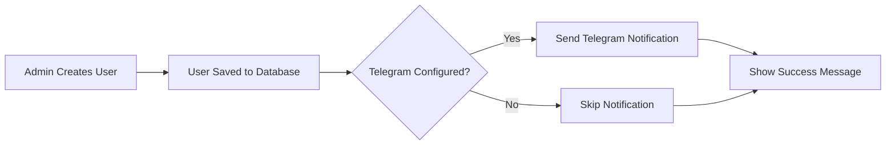
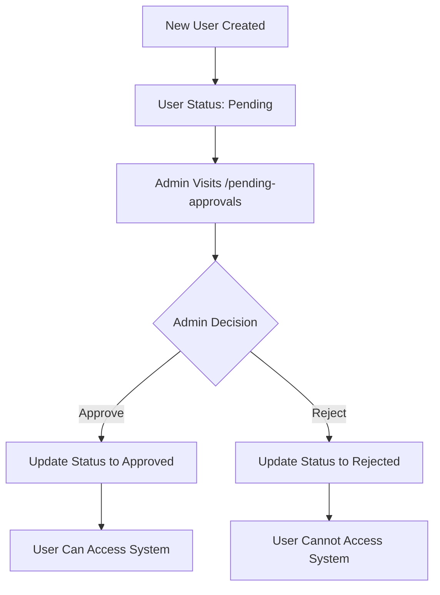

# Telegram Bot Approval Mechanism Documentation

## Overview

The Telegram Bot Approval Mechanism allows administrators to receive instant notifications via Telegram when new users are registered and manage their approval status directly through the dashboard.

## Features

### 1. **Telegram Notifications**
- Automatic notification to admin when a new user is created
- Formatted message with user details (name, rank, NRP/NIP, satfung, client)
- Configurable via environment variables

### 2. **Pending Approvals Dashboard**
- Dedicated page at `/pending-approvals` to view all users awaiting approval
- Real-time refresh every 30 seconds
- Clean, intuitive UI with user cards showing all relevant information

### 3. **Approval Actions**
- **Approve**: Instantly approve a user with one click
- **Reject**: Reject with optional reason that can be communicated back
- Loading states and error handling for all actions

### 4. **Status Banner**
- Displays configuration status of Telegram Bot
- Guides users to set up required environment variables

## Setup Instructions

### 1. Create a Telegram Bot

1. Open Telegram and search for [@BotFather](https://t.me/botfather)
2. Send `/newbot` command
3. Follow the instructions to create your bot
4. Copy the bot token (looks like: `123456789:ABCdefGHIjklMNOpqrsTUVwxyz`)

### 2. Get Your Chat ID

1. Send a message to your bot
2. Visit: `https://api.telegram.org/bot<YOUR_BOT_TOKEN>/getUpdates`
3. Look for `"chat":{"id":` in the response
4. Copy the chat ID (a number like `987654321`)

### 3. Configure Environment Variables

Add the following to your `.env.local` file in the `cicero-dashboard` directory:

```bash
# Telegram Bot Token (required)
NEXT_PUBLIC_TELEGRAM_BOT_TOKEN=123456789:ABCdefGHIjklMNOpqrsTUVwxyz

# Telegram Admin Chat ID (required)
NEXT_PUBLIC_TELEGRAM_ADMIN_CHAT_ID=987654321
```

### 4. Restart the Application

```bash
cd cicero-dashboard
npm run dev
```

## How It Works

### User Creation Flow



### Approval Flow



## API Endpoints

### Backend Endpoints Required

The dashboard expects these backend endpoints to exist:

#### 1. Get Pending Approvals
```
GET /api/users/pending?client_id={clientId}

Response:
{
  "users": [
    {
      "user_id": "123456789",
      "nama": "John Doe",
      "title": "IPDA",
      "divisi": "RESERSE",
      "client_id": "POLRES_A",
      "client_name": "Polres A",
      "created_at": "2024-02-09T10:30:00Z",
      "insta": "johndoe",
      "tiktok": "johndoe",
      "email": "john@example.com"
    }
  ]
}
```

#### 2. Approve User
```
POST /api/users/{userId}/approve

Request Body:
{
  "notes": "Approved by admin"  // Optional
}

Response:
{
  "success": true,
  "user": { ... }
}
```

#### 3. Reject User
```
POST /api/users/{userId}/reject

Request Body:
{
  "reason": "Invalid credentials"  // Optional
}

Response:
{
  "success": true
}
```

## Usage Guide

### For Administrators

1. **Navigate to Pending Approvals**
   - Click "Persetujuan User" in the sidebar menu
   - Or visit `/pending-approvals` directly

2. **Review Pending Users**
   - See all users waiting for approval
   - View their details: name, rank, NRP/NIP, satfung, social media handles

3. **Approve a User**
   - Click the green "Setujui" (Approve) button
   - User immediately gains access to the system

4. **Reject a User**
   - Click the red "Tolak" (Reject) button
   - Optionally enter a reason for rejection
   - Click "Tolak User" to confirm

### For Users

When creating a new user in the User Directory:
1. Fill in all required fields (nama, pangkat, NRP/NIP, satfung)
2. Click "Simpan" to submit
3. If Telegram is configured, admin receives instant notification
4. User appears in the pending approvals list
5. Admin approves/rejects from the dashboard

## File Structure

```
cicero-dashboard/
├── app/
│   ├── users/
│   │   └── page.jsx                    # User creation with Telegram hook
│   └── pending-approvals/
│       └── page.tsx                    # Approval management page
├── components/
│   └── Sidebar.jsx                     # Navigation with approval link
└── utils/
    ├── api.ts                          # API functions for approvals
    └── telegram.ts                     # Telegram Bot integration
```

## Components

### `utils/telegram.ts`

Core utilities for Telegram Bot integration:

- `getTelegramBotToken()` - Retrieves bot token from env
- `getTelegramAdminChatId()` - Retrieves chat ID from env
- `isTelegramConfigured()` - Checks if Telegram is properly configured
- `sendTelegramMessage()` - Sends formatted message via Bot API
- `notifyAdminNewUser()` - Sends new user notification to admin
- `notifyUserApprovalStatus()` - Sends approval/rejection notification

### `utils/api.ts`

API functions for approval workflow:

- `getPendingApprovals(token, clientId?)` - Fetch pending users
- `approveUser(token, userId, notes?)` - Approve a user
- `rejectUser(token, userId, reason?)` - Reject a user

### `app/pending-approvals/page.tsx`

Main approval management UI:

- Real-time list of pending users
- Approve/reject buttons with loading states
- Rejection modal with reason input
- Telegram configuration status banner

## Security Considerations

1. **Environment Variables**
   - Never commit `.env.local` to version control
   - Bot token and chat ID are sensitive credentials

2. **API Authorization**
   - All approval endpoints require authentication token
   - Only authorized admins should have access to `/pending-approvals`

3. **Backend Validation**
   - Backend should validate approval permissions
   - Implement rate limiting on approval endpoints

## Troubleshooting

### Telegram Notifications Not Working

1. **Check Configuration**
   - Verify `NEXT_PUBLIC_TELEGRAM_BOT_TOKEN` is set correctly
   - Verify `NEXT_PUBLIC_TELEGRAM_ADMIN_CHAT_ID` is set correctly
   - Restart the dev server after adding env variables

2. **Check Bot Status**
   - Ensure you've sent `/start` to your bot at least once
   - Verify the bot is not blocked

3. **Check Console Logs**
   - Open browser console when creating a user
   - Look for any Telegram-related errors

### Approval Actions Not Working

1. **Check Backend Endpoints**
   - Ensure backend implements all required endpoints
   - Check API response format matches expected structure

2. **Check Network Tab**
   - Open browser DevTools > Network
   - Watch for API calls when clicking approve/reject
   - Check response status and body

## Future Enhancements

Potential improvements for future versions:

1. **Batch Operations**
   - Approve/reject multiple users at once
   - Bulk import with approval workflow

2. **Approval History**
   - Track who approved/rejected each user
   - View approval timeline and reasons

3. **Email Notifications**
   - Send email in addition to Telegram
   - Configurable notification preferences

4. **Approval Levels**
   - Multi-level approval workflow
   - Role-based approval permissions

5. **Auto-approval Rules**
   - Automatically approve users matching certain criteria
   - Configurable rules engine

## Support

For issues or questions:
- Check console logs for errors
- Review this documentation
- Contact the development team

## License

This feature is part of the Cicero Dashboard and follows the same license terms.
